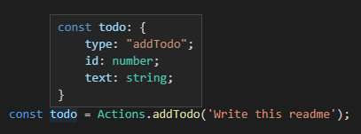
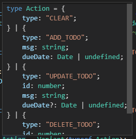

# Variant [](https://travis-ci.com/paarthenon/variant)  
> Variant types (a.k.a. Discriminated Unions) in TypeScript.

Variant is a set of tools for describing and working with flexible domain models. I want to express type hierarchies that I can **dispatch on at runtime** that still have compile time information that typescript can use to automatically **narrow the types at compile**. I don't want to have to *cast*, write my own user defined type guards, or repeat a string literal without having autocomplete and type safety to guide me. I want **nominal types** to express that this object with the same structure of another are actually different things.

Enter this library.

This is useful for protocol message processing, action creators, domain driven design, and general type fuckery. However, most of you likely use redux so....

## Let's say you use Redux

```typescript
// actions.ts (compare to https://redux.js.org/basics/example)
let nextTodoId = 0;
export const Actions = variantList([
    variant('addTodo ', (text: string) => ({
        id: nextTodoId++,
        text,
    })),
    variant('toggleTodo', fields<{id: number}>()),
    variant('setVisibilityFilter', payload<VisibilityFilters>()), 
]);

export type Actions = VariantsOf<typeof Actions>;
export type Action = OneOf<Actions>;

export const VisibilityFilters = strEnum([
    'SHOW_ALL',
    'SHOW_COMPLETED',
    'SHOW_ACTIVE',
]);
export type VisibilityFilters = keyof typeof VisibilityFilters;
```
**This is all type safe.**

The type definitions at the bottom takes the place of the whole
```typescript
export type Action =
    | Actions.addTodo
    | Actions.toggleTodo
    | Actions.setVisibilityFilter
;
```
mess you would normally have. Notably you no longer need to maintain the bookkeeping of this value when you add a new `Action`. It will automatically update.

Note unlike some other libraries viewing the types involved will provide specific and clear info.



As will the module: 



Meaning the reducers will work with typescript's native switch statement. 

> **Note**: I changed the name of the setVisibilityFilter action's property from `filter` to `payload` just to demonstrate the FSA-compliant helper function included in this library.

However, you don't *need* to use TypeScript's switch statement. You can leverage the `match` utility to elegantly express the same behavior. 

```typescript
// reducers/todos.ts (compare to https://redux.js.org/basics/example/#reducerstodosjs)
const todos = (state = [] as Todo[], action: Action) => {
    return match(action, {
        addTodo: ({id, text}) => [
            ...state,
            {
                id,
                text,
                completed: false,
            }
        ],
        toggleTodo: ({id}) => state.map(todo => todo.id === id ? {...todo, completed: !todo.completed} : todo),
        setVisibilityFilter: () => state,
    });
}
```

This is also type safe. You will be warned if you have forgotten a case in the handler object and the return type of match is the union of the return types of its various branches.

## How does it work?

This needs to be fleshed out. For now, here's a quick rundown

 - You create an instance of a variant by calling one of its tag constructors (the `Actions.addTodo()` function is the tag constructor (redux folks, think action creators))
 - the `variant` function is a factory function to *generate* tag constructors. 
    - It takes in a type string and a function that handles the logic of creating an object based on inputs.
    - The object gets the `type` property merged into it, the compiler gets updated type info.
    - So `variant('STR', (...args: Params) => ReturnVal);` gives you a function with the signature `(...args: Params) => ReturnVal & {type: 'STR'}`.
 - Now these constructors need to be grouped together to be meaningful in context.
    - Well, an object works. And it totally does, see the Q&A at the bottom. But if you don't have a meaningful reason to distinguish the name of the action creator from the `type` value of the object it generates then it feels *slightly* tedious.
    - Enter variantList, which just takes an array and turns it into an object by extracting the type from each variant and using it as the property name.
 - The `VariantsOf<T>` type extracts out the action creator return types (so the type `Actions['addTodo']` describes the resulting object's interface, not the function that created it)
 - The `OneOf<T>` type is essentually `Values<T>`. Given an object it will generate the union of the types of the values of said object.

### Nominal

Typescript has a [structural](https://www.typescriptlang.org/docs/handbook/type-compatibility.html) type system. This is useful in many different ways but there are some cases where it falls short. Sometimes you will have two objects that have the same structure but don't mean or do the same thing. [Nominal](https://www.wikiwand.com/en/Nominal_type_system) typing instead uses explicit type relationships to evaluate assignability. Sometimes that's real darn useful. Enter `type UserId = Nominal<number, 'userId'>`. Sometimes teammates would conflate a user's ID with the session used to reference the user in the active users collection. Making these different types resolved this issue.

;

Under the hood this claims a symbol exists on the first type parameter (it does not. This is purely at compile time).

Nominals are purely compile time tagged types. Variants are full blown run time switchable objects. They work together really well. Using variants with nominally typed identity fields is pretty swag. Being able to distinguish a `Guid` from a name at a type level feels great.

### Splitting the actions among files.

Variants can be easily manipulated. You destructure one like any other object.

```typescript
const {addTodo, completeTodo} = Actions;
```
Here's an example of creating multiple "subsets" of a variant by merging select values together.

```typescript
// Assume a variant called 'Attributes' up above that acts as the master list.

const FileAttributes = variantList([
    Attributes.Size,
    Attributes.URL,
    Attributes.CreatedDate,
    Attributes.UpdatedDate,
]);
type FileAttributes = VariantsOf<typeof MovieAttributes>;

const MovieAttributes = variantList([
    Attributes.Duration,
    Attributes.Resolution,
    Attributes.Bitrate,
]);
type MovieAttributes = VariantsOf<typeof MovieAttributes>;

```

I find this to be very helpful in organizing large quantities of subtypes.

It will also help manage more modular reducers. I can write a reducer like this and I will satisfy exhaustiveness checking as soon as I handle all the possibilities in the subtype alone.

I could just as easily construct the merged object

```typescript
export const Attributes = {
    ...FileAttributes,
    ...MovieAttributes,
    ...etc
}
export type Attributes = VariantsOf<typeof Attributes>
```

### Exhaustiveness Checking

OCaml and other functional languages will warn you when there's a potential pattern match you haven't thought of. Typescript can't be quite so advanced, but it can definitely warn you when you've forgotten a case in your switch statement.
 
The line in question is 
```typescript
default: return exhaust(action);
```
If we weren't handling all cases and it were possible to fall through to the default case then a type error would be raised because `exhaust(x)` is incompatible with anything besides `never`. If we somehow actually execute this code (say from javascript land) an `Error` can optionally be thrown with the type tag of the variant included in the message.


### Boilerplate

Here's a snippet that will take the little boilerplate this does require and make it trivial.

```json
	"VariantModule": {
		"prefix": ["variant-module", "vm"],
		"body": [
			"export const $1s = variantList([",
			"    $2",
			"]);",
			"export type $1s = VariantsOf<typeof $1s>;",
			"export type $1 = OneOf<$1s>;",
			""
		],
		"description": "Initialize a module for variants"
	},
```

### Q & A

### What if I want my variants to have different type values than variable names?

No problem. Don't use the `variantList` helper and just make an object:

```typescript
export const Actions = {
    addTodo: variant('ADD_TODO ', (text: string) => ({
        id: nextTodoId++,
        text,
    })),
    toggleTodo: variant('TOGGLE_TODO', fields<{id: number}>()),
    setVisibilityFilter: variant('SET_VISIBILITY_FILTER', payload<VisibilityFilters>()), 
};
```

### What if I want them at the top level?

Also not a problem.

```typescript
export const addTodo = variant('ADD_TODO ', (text: string) => ({
    id: nextTodoId++,
    text,
}));
export const toggleTodo = variant('TOGGLE_TODO', fields<{id: number}>());
export const setVisibilityFilter = variant('SET_VISIBILITY_FILTER', payload<VisibilityFilters>());
```