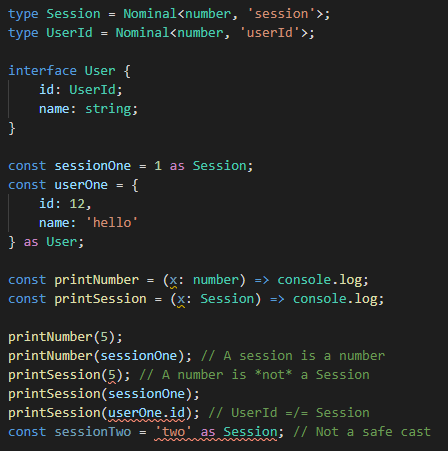

# **Variant** [](https://travis-ci.com/paarthenon/variant)  
> [A variant type](https://reasonml.github.io/docs/en/variant) is like an enum but each case can hold some extra data.

```bash
npm i -S variant
```

Variant aims to bring the experience of [variant types](https://dev.realworldocaml.org/variants.html) to TypeScript. Variant types, a.k.a. [discriminated unions](https://www.typescriptlang.org/docs/handbook/advanced-types.html#discriminated-unions) in the TypeScript world, are an excellent tool for describing and handling flexible domain models and tiny DSLs. However, because *"TypeScript instead builds on JavaScript patterns as they exist today"[(*)](https://www.typescriptlang.org/docs/handbook/advanced-types.html#discriminated-unions)* using them as-is can result in tedious and fragile code. This project addresses that by providing well-typed, fluent, and expressive tools to safely do away with the boilerplate.

 - [Introduction](#introduction)
 - [API](#api)
 - [Technique](#technique)
 - [Q & A](#q--a)


# Introduction 

### Let's use `variant` to describe a domain — **Animals**. [Or if you'd like a redux example...](#lets-say-you-use-redux)
```typescript
import variant, {variantList, VariantOf, fields, TypeNames} from 'variant';

const Animal = variantList([
    variant('dog', fields<{name: string, favoriteBall?: string}>()),
    variant('cat', fields<{name: string, daysSinceDamage: number}>()),
    variant('snake', (name: string, patternName?: string) => ({
        name,
        pattern: patternName ?? 'striped',
    })),
]);
type Animal<T extends TypeNames<typeof Animal> = undefined> = VariantOf<typeof Animal, T>;
```

and using the created variant `Animal` looks something like...

```typescript
import {Animal} from '...';

const snek = Animal.snake('steve');
console.log(snek); 
// {type: 'snake', name: 'steve', pattern: 'striped'}
const describeSnake = (snake: Animal<'snake'>) => {...}
const describeAnimal = (animal: Animal) => {...}
```

## **Match**

We can now process the union using **match**, an alternative to the switch statement. [See test examples](src/variant.match.spec.ts).

```typescript
import {match} from 'variant';

const describeAnimal = (animal: Animal) => match(animal, {
    cat: ({name}) => `${name} is sleeping on a sunlit window sill.`,
    dog: ({name, favoriteBall}) => [
        `${name} is on the rug`,
        favoriteBall ? `nuzzling a ${favoriteBall} ball.` : '.' 
    ].join(' '),
    snake: s => `Hi ${s.name}, your ${s.pattern} skin looks nice today.`,
});
```

### `match` is...


 - **exhaustive by default**. If you only need to handle some cases, use `partialMatch`.
 - **pure TypeScript.** This will work on any valid discriminated union, whether or not it was made with `variant`.
 - **well typed**. `match`'s return type is the union of the return types of all the potential handler functions. `partialMatch` does the same but adds `undefined` to the union.
 - **familiar**. It's meant to imitate the [OCaml / Reason ML **`match`** statement](https://ocaml.org/learn/tutorials/data_types_and_matching.html#Pattern-matching-on-datatypes).
 - **flexible**. By default `match` switches on the `type` property which can be overridden using the function's optional third paramater. 

## **Lookup**

If you don't need to perform any actions or use any of the union's data, use **lookup**.

```typescript
import {lookup} from 'variant';

const cuteName = lookup(animal, {
    cat: 'kitty',
    dog: 'pupper',
    snake: 'snek',
});
```

The above notes on `match` also apply to `lookup`

****
## Variant Cheat Sheet
 - **Import:** `import {Animal} from '...';`
 - **Create snake:** `Animal.snake('steve');`
 - **Snake Type:** `Animal<'snake'>`
 - **Union Type:** `Animal`

****

## **Motivation**

TypeScript has an inherent problem. Interfaces and inferred types only exist at compile time, but inspecting a type can only be done at runtime. Classes are one option to provide compile time type checking and runtime behavior together but they don't serialize, so we can't send them over the network or shove them in a redux store. Enter this library.

You could certainly do this with raw discriminated unions, but here's that animal example again. 

```typescript
// vanilla typescript
const DOG_TYPE = 'dog';
const CAT_TYPE = 'cat';
const SNAKE_TYPE = 'snake';

function dog(name: string, favoriteBall?: string) {
    return {
        type: DOG_TYPE as typeof DOG_TYPE,
        name,
        favoriteBall,
    }
}
const cat = (name: string, daysSinceDamage: number) => ({
    type: CAT_TYPE as typeof CAT_TYPE,
    name,
    daysSinceDamage,
})
const snake = (name: string, patternName?: string) => ({
    type: SNAKE_TYPE as typeof SNAKE_TYPE,
    name,
    pattern: patternName ?? 'striped',
})

type Animal = 
    | ReturnType<typeof dog>
    | ReturnType<typeof cat>
    | ReturnType<typeof snake>;
;
```

**Both methods result in the following union type:**


But one is shorter, *automatically updates* as I add new animals, and requires **no manual casting**.
# API

## **Variant**

Calling `variant` with a given type name returns a [*tag constructor*](https://en.wikipedia.org/wiki/Algebraic_data_type#Explanation) (a.k.a. *action creator*) for that type. 

```typescript
import variant from 'variant';
const toggleTodo = variant('TOGGLE_TODO');

const action = toggleTodo(); 

// typeof action: { type: 'TOGGLE_TODO' }
```

But if we're toggling a todo we probably need to identify which one. To start doing something interesting we essentially provide `variant` with what the constructor function should take in and do. We do this like any old function, `variant` wraps our function and takes care of the housekeeping of merging in the `{ type: 'TOGGLE_TODO }'` property to whatever we return.

```typescript
import variant from 'variant';

const toggleTodo = variant('TOGGLE_TODO', (id: number) => ({id}));
const action = toggleTodo(4); 

// typeof action: { type: 'TOGGLE_TODO', id: number }
console.log(action); // { type: 'TOGGLE_TODO', id: 4 }
```

Once we add a few fields our parameters will start to lose meaning. Passing in an object is more or less how javascript handles named parameters. To easily describe such constructors, use the `fields<T>()` helper function. 

```typescript
import variant, {fields} from 'variant';

const toggleTodo = variant('TOGGLE_TODO', fields<{id: number}>());
const action = toggleTodo({id: 4}); 

// typeof action: { type: 'TOGGLE_TODO', id: number }
console.log(action); // { type: 'TOGGLE_TODO', id: 4 }
```

When only one property is required or FSA compliance is desired, the `payload<T>()` helper function is available.

```typescript
import variant, {payload} from 'variant';

const toggleTodo = variant('TOGGLE_TODO', payload<number>());
const action = toggleTodo(4); 

// typeof action: { type: 'TOGGLE_TODO', payload: number }
console.log(action); // { type: 'TOGGLE_TODO', payload: 4 }
```

When deciding on `payload` vs. `fields` consider whether the name of the tag is so self descriptive its obvious what the intended payload would be.


[See more test examples](src/variant.spec.ts).

### **Grouping**

Getting to the "Algebra" of algebraic data types, variants can be mixed and matched in a number of ways. If you have a functional programming background, `variant()` is a factory function to generate tag constructors of [polymorphic variants](https://www.cs.cornell.edu/courses/cs3110/2019sp/textbook/data/polymorphic_variants.html). If you don't have a functional programming background, ignore that sentence. `variant()` describes one shape your data may take, but we want to understand the options.

To make that as easy as possible, try `variantList([ ... ])`.

```typescript
export const MediaFile = variantList([
    variant('image', fields<{src: string}>(),
    variant('video', fields<{src: string, duration: number}>()),
]);
```
If you'd prefer not to use that, no problem. Use an object.

```typescript
export const MediaFile = {
    image: variant('image', fields<{src: string}>(),
    video: variant('video', fields<{src: string, duration: number}>()),
}
```
Either way, follow up with this type

```typescript
export type MediaFile<T extends TypeNames<typeof MediaFile> = undefined> = VariantOf<typeof MediaFile, T>;
```

The line does two main things.

1.  It takes place of this tedious mess:

    ```typescript
    export type Action =
        | Action.addTodo
        | Action.toggleTodo
        | Action.setVisibilityFilter
    ;
    ```
    and will automatically update. 

2. It provides a way to access subtypes easily. `MediaFile<'image'>` refers to `{ type: 'image', src: string }`. 

#### Boilerplate 

Here is a [VS Code snippet](https://code.visualstudio.com/docs/editor/userdefinedsnippets) to make following this pattern very easy.
```json
	"VariantModule": {
		"prefix": ["variant-module", "vm"],
		"body": [
			"export const $1 = variantList([",
			"    $2",
			"]);",
			"export type $1<T extends TypeNames<typeof $1> = undefined> = VariantOf<typeof $1, T>;",
			""
		],
		"description": "Initialize a module for variants"
	},
```

### **Casting and Narrowing**

Let's say you have an `animal: Animal` and you're sure it's a snake or you only care about it if it's a snake. Here are a couple of shortcuts to help with that.

If you're sure it's a snake, use cast.
```typescript
const snake = cast(animal, 'snake'); // typeof snake === Animal<'snake'>;
```
The second property will only allow valid keys of animal.

> Yes this is equivalent to `const snake = animal as Animal<'snake'>` but is cleaner in a `useSelector` call. Imagine `state.view` is a variant of menu states like `Game`, `Settings`, `About`, `MainMenu`.
> ```typescript
> // settingsPage.tsx
> const graphicsSettings = useSelector((state: RootState) => cast(state.view, 'Settings').graphics);
> ```


If you're not sure it's a snake, try to narrow it.

```typescript
const snake = narrow(animal, 'snake'); // typeof snake === (Animal<'snake'> | undefined);

console.log(snake?.pattern);
```
Like before, the second property can only be a valid key of `Animal`. If `animal` is in fact a snake you get it back. If not, you get undefined. This works very well with the optional chaining operator in TypeScript. Especially when you get a deeper object in the tree. 

> Yes this is equivalent to `const snake = partialMatch(animal, {snake: s => s});` but it's way more readable. It's also clearer in a `useSelector` call.
> ```typescript
> // settingsPage.tsx
> const graphicsSettings = useSelector((state: RootState) => 
>     narrow(state.view, 'Settings')?.graphics ?? DEFAULT_GRAPHICS_SETTINGS);
> ```


### **Undocumented (TBD)**

 * There is a function called `augment` that will let you mixin a property to every form of a variant type. I use this to easily and unobtrusively add auditing fields.
 * `flags` is like `variantList` but instead of taking in `VariantCreators` it takes in a list of generated objects and generates a mapped object similar to the flags or options fields in C programs and modern JS.
 * `fields` actually has two functions attached to it, `set` and `default` that I use to set extra or default values.
 * **This can use enums as keys.** See the tests, I don't have docs but I have examples.

# Technique


## Let's say you use Redux

Compare to [the official redux example](https://redux.js.org/basics/example).
```typescript
// actions.ts 
import variant, {variantList, VariantOf, TypeNames, fields, payload, strEnum} from 'variant';

let nextTodoId = 0;
export const Action = variantList([
    variant('addTodo', (text: string) => ({
        id: nextTodoId++,
        text,
    })),
    variant('toggleTodo', fields<{id: number}>()),
    variant('setVisibilityFilter', payload<VisibilityFilters>()), 
]);

export type Action<T extends TypeNames<typeof Action> = undefined> = VariantOf<typeof Action, T>;

export const VisibilityFilters = strEnum([
    'SHOW_ALL',
    'SHOW_COMPLETED',
    'SHOW_ACTIVE',
]);
export type VisibilityFilters = keyof typeof VisibilityFilters;
```
Compare the following reducer to [the official redux example reducer](https://redux.js.org/basics/example/#reducerstodosjs).
```typescript
// reducers/todos.ts
import {match} from 'variant';

const todos = (state = [] as Todo[], action: Action) => {
    return match(action, {
        addTodo: ({id, text}) => [
            ...state,
            {
                id,
                text,
                completed: false,
            }
        ],
        toggleTodo: ({id}) => state.map(todo => todo.id === id ? {...todo, completed: !todo.completed} : todo),
        setVisibilityFilter: () => state,
    });
}
```

## Overview

### Object literals and custom keys

By default lookup and match expect to dispatch on the `type` property. To override this behavior, pass the key the function *should* care about as a third optional parameter. Using [`shorthand property names` in an object literal](https://developer.mozilla.org/en-US/docs/Web/JavaScript/Reference/Operators/Object_initializer), you get this pretty clean syntax.

```typescript
declare var filter: VisibilityFilters; // 'SHOW_ALL' | 'SHOW_COMPLETED' | 'SHOW_ACTIVE'

const filterLabel = lookup({filter}, {
    SHOW_ALL: 'Show All',
    SHOW_COMPLETED: 'Show Completed',
    SHOW_ACTIVE: 'Show Active',
}, 'filter');
```

### Partial match and lookup

If you only need to act on some possibilities and not others, use the **partial*** versions of each of these functions. 

```typescript
import {partialLookup} from 'variant';

declare var action: Action;

const description = partialLookup(action, {
    addTodo: 'Add a new todo item.',
}) ?? 'Who the hell knows.';
```
`partialLookup` and `partialMatch` behave like their emotionally fulfilled counterparts except they do not require all properties (*autocomplete still works*) and may return `undefined`. This dovetails nicely with [TypeScript 3.7's Nullish Coalescing](https://www.typescriptlang.org/docs/handbook/release-notes/typescript-3-7.html#nullish-coalescing) [`??`] operator to provide a natural way of providing a default value and removing `undefined` from the potential results of a `partialLookup` or `partialMatch`.

**Or maybe** take advantage of the fact that partial returns a nullish value to conditionally render a component

```tsx
// setup
import {MediaFile} from '../earlier';

// component
export const Preview: React.FC<{media: MediaFile}>: ({media}) => {
    return (
        <div>
            <p>Attributes</p>
            <ul>
                <li>src: {media.src}</li>
                {partialMatch(media, {
                    video: ({duration}) => <li>duration: {duration}</li>
                })
            </ul>
        </div>
    )
}
```


### Using an existing lookup table

This mapping can be created ahead of time.

```typescript
import {lookup, Lookup} from 'variant';

declare var action: Action;

const actionDescriptions: Lookup<Actions> = {
    addTodo: 'Add a new todo item.',
    toggleTodo: 'Toggle completion status.',
    setVisibilityFilter: 'Filter visible todos.',
};

const description = lookup(action, actionDescriptions);
```

The equivalent type for `match` and `partialMatch` is `Handler<T>`.

Partial versions have a very similar story.

```typescript
import {partialLookup, Lookup} from 'variant';

declare var action: Action;

const actionDescriptions: Partial<Lookup<Actions>> = {
    addTodo: 'Add a new todo item.',
};

const description = partialLookup(action, actionDescriptions) ?? 'Who the hell knows.';
```

## Nominal

Typescript has a [structural](https://www.typescriptlang.org/docs/handbook/type-compatibility.html) type system. This is useful in many different ways but there are some cases where it falls short. Sometimes you will have two objects that have the same structure but don't mean or do the same thing. [Nominal](https://www.wikiwand.com/en/Nominal_type_system) typing instead uses explicit type relationships to evaluate assignability. Sometimes that's real darn useful. Enter `type UserId = Nominal<number, 'userId'>`. Sometimes teammates would conflate a user's ID with the session used to reference the user in the active users collection. Making these different types resolved this issue.

;

Under the hood this claims a symbol exists on the first type parameter (it does not. This is purely at compile time).

Nominals are purely compile time tagged types. Variants are full blown run time switchable objects. They work together really well. Using variants with nominally typed identity fields is pretty swag. Being able to distinguish a `Guid` from a name at a type level feels great.


## How does it work?

This needs to be fleshed out. For now, here's a quick rundown

 - You create an instance of a variant by calling one of its tag constructors (the `Actions.addTodo()` function is the tag constructor (redux folks, think action creators))
 - the `variant` function is a factory function to *generate* tag constructors. 
    - It takes in a type string and a function that handles the logic of creating an object based on inputs.
    - The object gets the `type` property merged into it, the compiler gets updated type info.
    - So `variant('STR', (...args: Params) => ReturnVal);` gives you a function with the signature `(...args: Params) => ReturnVal & {type: 'STR'}`.
 - Now these constructors need to be grouped together to be meaningful in context.
    - Well, an object works. And it totally does, see the Q&A at the bottom. But if you don't have a meaningful reason to distinguish the name of the action creator from the `type` value of the object it generates then it feels *slightly* tedious.
    - Enter variantList, which just takes an array and turns it into an object by extracting the type from each variant and using it as the property name.
 - `VariantOf<T>` is where the magic happens, but it's ultimately `OneOf<VariantOf<T>>` with some special sauce.
    - The `VariantOf<T>` type extracts out the action creator return types (so the type `Actions['addTodo']` describes the resulting object's interface, not the function that created it)
    - The `OneOf<T>` type is essentually `Values<T>`. Given an object it will generate the union of the types of the values of said object.


# Q & A

### **How can I work with variants across multiple files?**

Variants can be easily manipulated. You destructure one like any other object.

```typescript
const {addTodo, completeTodo} = Actions;
```
Here's an example of creating multiple "subsets" of a variant by merging select values together.

```typescript
// Assume a variant called 'Attributes' up above that acts as the master list.

const FileAttributes = variantList([
    Attributes.Size,
    Attributes.URL,
    Attributes.CreatedDate,
    Attributes.UpdatedDate,
]);
type FileAttributes = VariantsOf<typeof MovieAttributes>;

const MovieAttributes = variantList([
    Attributes.Duration,
    Attributes.Resolution,
    Attributes.Bitrate,
]);
type MovieAttributes = VariantsOf<typeof MovieAttributes>;

```

I find this to be very helpful in organizing large quantities of subtypes.

It will also help manage more modular reducers. I can write a reducer like this and I will satisfy exhaustiveness checking as soon as I handle all the possibilities in the subtype alone.

I could just as easily construct the merged object

```typescript
export const Attributes = {
    ...FileAttributes,
    ...MovieAttributes,
    ...etc
}
export type Attributes = VariantsOf<typeof Attributes>
```

### **Do I have to use the `type` property?**

**No. Use whatever you like.** The library is built with `type` as a default for usability but every type and function that matters has a parameter that allows you to override the type parameter it looks at. You can even create your own version of the `variant` function that uses a different property name by calling `variantFactory('name')` where `name` is whatever the discriminating property is.

### **How can I make sure I haven't forgotten a case?**

A simple way would be to use `match`. However TypeScript's own switch function is certainly up to the task. To do so add the following line to your switch statement.
```typescript
import {exhaust} from 'variant'; 

// ...
    default: return exhaust(action);
// ...
```

### **What if I want my variants to have different type values than variable names?**

No problem. Don't use the `variantList` helper and just make an object:

```typescript
export const Actions = {
    addTodo: variant('ADD_TODO ', (text: string) => ({
        id: nextTodoId++,
        text,
    })),
    toggleTodo: variant('TOGGLE_TODO', fields<{id: number}>()),
    setVisibilityFilter: variant('SET_VISIBILITY_FILTER', payload<VisibilityFilters>()), 
};
```

### **What if I want them at the top level?**

Also not a problem.

```typescript
export const addTodo = variant('ADD_TODO ', (text: string) => ({
    id: nextTodoId++,
    text,
}));
export const toggleTodo = variant('TOGGLE_TODO', fields<{id: number}>());
export const setVisibilityFilter = variant('SET_VISIBILITY_FILTER', payload<VisibilityFilters>());
```

### **Can I match on a strEnum?**

Yes, use `matchLiteral` instead of `match`.

```typescript
const things = strEnum([
    'a',
    'b',
    'c',
])
type things = keyof typeof things;

const handleThing = (thing: things) => matchLiteral(thing, {
    a: _ => 1,
    b: b => b,
    c: _ => '3',
});
```